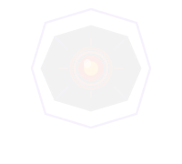

#  OracleMK1: The Prescription Simulation Engine for Hospitals

**An MCP-powered Clinical Decision Support system that enables Hospital AI Copilots to run deterministic compatible biological simulations on high-cost Drugs.**

Built for the **Prompt Opinion / Darena Health "Agents Assemble" Hackathon** *(Track 1: Build a Superpower)*.

---

# 🚨 The Problem: LLMs Cannot Simulate Biology

When a doctor asks an AI Copilot:

> *"Will Osimertinib work for Patient X?"*

the LLM typically relies on generalized training data and probabilistic inference to generate an answer.

**This is dangerous.**

Standard LLMs cannot:
- calculate pharmacogenomic interactions,
- factor real-time renal clearance,
- evaluate hepatic toxicity risk,
- or mathematically simulate treatment efficacy.

They generate plausible language — not biological validation.

In oncology, the difference between a life-saving therapy and a catastrophic mistake can hinge on a handful of genomic markers. A single wrong treatment decision can cost a patient not only months of physical suffering, but also tens of thousands of dollars in ineffective or toxic therapy.

When a treatment cycle costs \$15,000 or more, "probably correct" is not reassuring enough.

---

# 🚀 The Superpower: Predictive Clinical Simulation

OracleMK1 gives Hospital LLMs a deterministic simulation layer through the **Model Context Protocol (MCP)**.

Instead of guessing, the AI Copilot securely passes a patient context (via Darena Health's **SHARP protocol**) into OracleMK1. The engine then retrieves synthetic **FHIR R4** clinical records and executes a weighted biological simulation to estimate treatment efficacy using genomic and physiological signals.

Rather than replacing physicians, OracleMK1 acts as a computational validation layer for high-risk treatment decisions.

---

# ✨ The Simulation Pipeline

## 🤖 1. Clinical Hypothesis Trigger
The physician asks the Copilot a treatment question. The LLM invokes OracleMK1's `evaluate_prescription()` MCP tool to test the scenario.

---

## 🚦 2. Cost-Based Triage Gate
To optimize hospital compute and reduce unnecessary inference overhead, OracleMK1 refuses low-risk simulations (e.g. Amoxicillin).

Deep simulation only activates for:
- high-cost therapies,
- oncology TKIs,
- or clinically high-risk prescriptions.

---

## 🔬 3. Deep Biological Simulation
The engine computes a weighted `P_success` score using patient-specific FHIR observations:

### Genomic Signals
- **T790M / AF Driver Mutation Ratios** *(35%)*
- **CYP3A4 Gene Activity Scores** *(25%)*

### Physiological Signals
- **eGFR Renal Clearance** *(20%)*
- **Hepatic ALT/AST Stress Markers** *(10%)*

### Core Model

```math
P_{success} = \sum_{i=1}^{n}(w_i \cdot s_i)

```



*Built with determinism. Powered by biology and maths. Designed for hospitals.*

